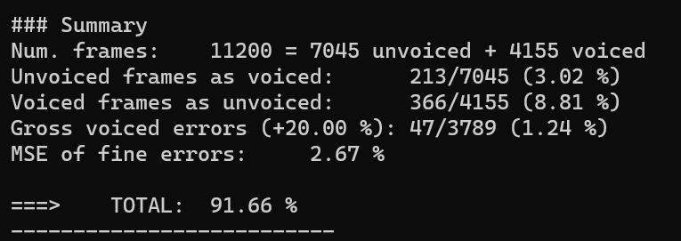
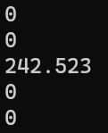

PAV - P3: detección de pitch
============================

Esta práctica se distribuye a través del repositorio GitHub [Práctica 3](https://github.com/albino-pav/P3).
Siga las instrucciones de la [Práctica 2](https://github.com/albino-pav/P2) para realizar un `fork` de la
misma y distribuir copias locales (*clones*) del mismo a los distintos integrantes del grupo de prácticas.

Recuerde realizar el *pull request* al repositorio original una vez completada la práctica.

Ejercicios básicos
------------------

- Complete el código de los ficheros necesarios para realizar la detección de pitch usando el programa
  `get_pitch`.

   * Complete el cálculo de la autocorrelación e inserte a continuación el código correspondiente.

   ```c++
for (unsigned int l = 0; l < r.size(); ++l) {
      r[l]=0;
      for (unsigned int n = l; n<x.size(); n++){
        r[l] += x[n-l]*x[n];
      }
    }

    if (r[0] == 0.0F) //to avoid log() and divide zero 
      r[0] = 1e-10; 
  }
```

   * Inserte una gŕafica donde, en un *subplot*, se vea con claridad la señal temporal de un segmento de
     unos 30 ms de un fonema sonoro y su periodo de pitch; y, en otro *subplot*, se vea con claridad la
	 autocorrelación de la señal y la posición del primer máximo secundario.

   _La señal la hemos cogido de la database: [sb050.wav](matlab_code/sb050.wav) es una mujer que dice: "so many overwhelm me and I was move to tears", hemos seleccionado el instante de tiempo de la vocal a y calculado su autocorrelación. Utilizando el lag del primer máximo, obtenemos un pitch=1/lag*fs=232.5581Hz, tambien hemos utilizado la funcion [pitch()](https://www.mathworks.com/help/audio/ref/pitch.html) de la [toolbox de audio](https://www.mathworks.com/help/audio/) para comprobar el resultado (esta función nos da la opción de calcular el pitch con diferentes métodos a parte de la autocorrelación, ej:Cepstrum Pitch Determination), hemos obtenido el mismo resultado, por lo que concluimos que es un buen método para estimar el pitch y que el parlante se trata de una mujer, lo que corroboramos fácilmente escuchando el audio._

   

   _Hemos utilizado Matlab para realizar este ejercicio, el script se encuentra en: [autocorr_ej.m](matlab_code/autocorr_ej.m)_

Code:
```Matlab
clc
clear
close all

filename='sb050.wav';
[y,fs]=audioread(filename);
sound(y,fs);    %play signal 'so many overwhelm me and I was move to tears'

ty=0:1/fs:(length(y)-1)*1/fs;
figure
plot(ty,y);
title(['Signal:', filename]);
xlabel('[s]')

tstart=1.11; %1.11 seconds, A vowel of the word mAny
Nstart=tstart*fs;   %
tmax=tstart+0.03;  %30ms
N=tmax*fs;  %sample

x=y(Nstart:N);  %cut signal
sound(x,fs);    %play new signal
t=linspace(tstart,tmax,numel(x));  %time index of new signal


cxx=xcorr(x);   %autocorrelation

figure
subplot(2,1,1);
plot(t,x);
title(['30ms of the vowel A, filename: ',filename]);
xlabel('[s]');

subplot(2,1,2);
c0=round(length(cxx)/2);
plot(cxx(c0:end))
title('Autocorrelation');
%plot important values
str = {['r[0]=', num2str(cxx(c0)),'  r[1]=',num2str(cxx(c0+1)),'  r[lag=86]=',num2str(cxx(c0+86))]};
text(290,1.25,str,'Color','blue')

%% pitch value
lag=86;
pitch1=1/lag*fs

%% find pitch using pitch() function of Audio toolbox
%pitch() default window is round(fs*0.052)=52 ms
tstart=1.109; %1.11 seconds, A vowel of the word MANY
Nstart=tstart*fs;   %
tmax=tstart+0.052;  %30ms
N=tmax*fs;  %sample

x2=y(Nstart:N);  %cut signal
f0 = pitch(x2,fs)
```

	 NOTA: es más que probable que tenga que usar Python, Octave/MATLAB u otro programa semejante para
	 hacerlo. Se valorará la utilización de la librería matplotlib de Python.

   * Determine el mejor candidato para el periodo de pitch localizando el primer máximo secundario de la
     autocorrelación. Inserte a continuación el código correspondiente.

     ```c
  vector<float>::const_iterator iR = r.begin(), iRMax = r.begin() + npitch_min;

  for(iR = r.begin() + npitch_min; iR < r.begin()+npitch_max; iR++){
    if(*iR > *iRMax){
      iRMax = iR;
    }
  }
  //https://stackoverflow.com/questions/7719978/finding-max-value-in-an-array/43921864

  unsigned int lag = iRMax - r.begin();
```

   * Implemente la regla de decisión sonoro o sordo e inserte el código correspondiente.

   ```c++
    if((r1norm > threshold1 || rmaxnorm > threshold2) && pot < threshold3){
      return false;
    }else{
      return true;
    }
```

- Una vez completados los puntos anteriores, dispondrá de una primera versión del detector de pitch. El 
  resto del trabajo consiste, básicamente, en obtener las mejores prestaciones posibles con él.

  * Utilice el programa `wavesurfer` para analizar las condiciones apropiadas para determinar si un
    segmento es sonoro o sordo. 
	
	  - Inserte una gráfica con la detección de pitch incorporada a `wavesurfer` y, junto a ella, los 
	    principales candidatos para determinar la sonoridad de la voz: el nivel de potencia de la señal
		(r[0]), la autocorrelación normalizada de uno (r1norm = r[1] / r[0]) y el valor de la
		autocorrelación en su máximo secundario (rmaxnorm = r[lag] / r[0]).

    
    _Imagen del .wav y de la estimación de pitch de nuestro programa_

    
    _Imagen de la estimación de pitch junto a potencia-r(1)/r(0)-r(lag)/r(0)._


		Puede considerar, también, la conveniencia de usar la tasa de cruces por cero.

	    Recuerde configurar los paneles de datos para que el desplazamiento de ventana sea el adecuado, que
		en esta práctica es de 15 ms.

      - Use el detector de pitch implementado en el programa `wavesurfer` en una señal de prueba y compare
	    su resultado con el obtenido por la mejor versión de su propio sistema.  Inserte una gráfica
		ilustrativa del resultado de ambos detectores.

    

    _Como podemos observar a simple vista el pitch obtenido por el Wavesurfer está
    desplazado respecto al obtenido por nuestro programa, por otro lado, si nos
    fijamos en la forma de los puntos de la estimación de pitch que nos proporciona
    Wavesurfer (2º gráfica) observamos que coinciden con la forma de nuestra
    estimación de pitch (3º gráfica) teniendo disparidades en algunas pequeñas
    zonas, pero en general se parecen._
  
  * Optimice los parámetros de su sistema de detección de pitch e inserte una tabla con las tasas de error
    y el *score* TOTAL proporcionados por `pitch_evaluate` en la evaluación de la base de datos 
	`pitch_db/train`..

  

   * Inserte una gráfica en la que se vea con claridad el resultado de su detector de pitch junto al del
     detector de Wavesurfer. Aunque puede usarse Wavesurfer para obtener la representación, se valorará
	 el uso de alternativas de mayor calidad (particularmente Python).
   _Pregunta repetida !!_
   

Ejercicios de ampliación
------------------------

- Usando la librería `docopt_cpp`, modifique el fichero `get_pitch.cpp` para incorporar los parámetros del
  detector a los argumentos de la línea de comandos.
  
  Esta técnica le resultará especialmente útil para optimizar los parámetros del detector. Recuerde que
  una parte importante de la evaluación recaerá en el resultado obtenido en la detección de pitch en la
  base de datos.

  * Inserte un *pantallazo* en el que se vea el mensaje de ayuda del programa y un ejemplo de utilización
    con los argumentos añadidos.

    


- Implemente las técnicas que considere oportunas para optimizar las prestaciones del sistema de detección
  de pitch.

  Entre las posibles mejoras, puede escoger una o más de las siguientes:

  * Técnicas de preprocesado: filtrado paso bajo, *center clipping*, etc.

  ```c
  /// \TODO
  /// Preprocess the input signal in order to ease pitch estimation. For instance,
  /// central-clipping or low pass filtering may be used.
  /// \DONE
  /// Center-clipping implementado

  //float th_cc = 0.05;
  float th_cc=maxPot*alpha_cc;
  for (unsigned int i=0; i < x.size(); ++i){
    if(abs(x[i]) < th_cc){
      x[i] = 0;
    }else if( x[i] > th_cc){
      x[i]=x[i] - th_cc;
    }else if( x[i]< -th_cc){
      x[i]=x[i] + th_cc;
    }
  }
  ```
_Ejemplo con matlab: [central_clipping_ej.m](matlab_code/central_clipping_ej.m)_
  

  _El threshold usado en el center-clipping lo sacamos multiplicando el parámetro alpha por la potencia máxima de la señal (potencia del tramo con mayor potencia). Así no utilizamos el mismo threshold para todas las señales de la database, y creamos una dependencia para ajustarlo a la potencia de cada señal._

  _Esto nos crea una incoherencia en la normalización de la potencia, ya que hacemos el clipping después de calcular la potencia máxima de toda la señal, por lo que después del clipping esta potencia será menor (Ejemplo del ‘error’: en la trama con potencia máxima, al normalizar no nos dará 1 sino un valor menor, esto pasa en todas las tramas). Tendríamos que volver a calcularla. Comentamos este 'error' pero no acaba afectando a la decisión final, simplemente nos reduce el valor de todas las potencias normalizadas por lo que solo tendremos que reducir un poco el threshold de la potencia._

  

  _P_cc es la potencia que hemos quitado con el central clipping._

  * Técnicas de postprocesado: filtro de mediana, *dynamic time warping*, etc.

  _En el código (DONE) hay una explicación del método usado.
Filtro de mediana:_
  ```c
  /// \TODO
  /// Postprocess the estimation in order to supress errors. For instance, a median filter
  /// or time-warping may be used.

  /// \DONE 
  /// Median filter, this method of medianfilter uses a moving window with a length of L. The value at point n is determined by the data from point n-(L-1)/2 to point n+(L-1)/2.
  /// Then the median value in these L points is chooses as the value of the point n. */
  /// colab info:https://stackoverflow.com/questions/2114797/compute-median-of-values-stored-in-vector-c
    if(M%2){ //if M is odd
    vector<float> f0filtered = f0;

    unsigned int L_median_W = M;
    vector<float> window(L_median_W);

    unsigned int offset = (L_median_W-1)/2;
    for (unsigned int n=offset; n<f0.size()-offset; ++n){ //for starts at ceil(N_window/2-1)
      //vector<float> window {f0[n-1] , f0[n], f0[i+n]};
      for (unsigned int j=0; j<L_median_W; ++j)
        window[j] = f0[n - offset + j];

    //window.insert(window.begin(), f0[i-n] , f0[n], f0[n+1]);
      sort(window.begin(), window.end());
      //Get result, middle element
      f0filtered[n]=window[offset];
    //window.clear();
    }
    f0=f0filtered;
  }
  ```

  _Probando diferentes longitudes de ventanas L hemos llegado a las siguientes conclusiones: una ventana mayor a 5 (2 valores a cada lado) perjudica los resultados, con L=5 obtenemos un mejor resultado que si no utilizamos el filtro de mediana (L=0) y con una longitud de ventana, L=3, (1 valor a cada lado) obtenemos el mejor resultado, eliminando esos picos repentinos en la gráfica del pitch que vemos en la figura del wavesurfer, sin perjudicar demasiado los límites y la precisión, lo que sí pasa con una L mayor._
  
  _Ejemplo: antes del filtro mediana, vemos algunos picos, o al reves vemos algunos valles fugazes que no se corresponden al pitch._

   

   _despues del filtro mediana L=3:_

   

  * Métodos alternativos a la autocorrelación: procesado cepstral, *average magnitude difference function*
    (AMDF), etc.
  * Optimización **demostrable** de los parámetros que gobiernan el detector, en concreto, de los que
    gobiernan la decisión sonoro/sordo.

    _Para la optimización hemos terminado haciéndola igual que en la practica 2, shell script de optimizacion: [run_get_pitch.sh](scripts/run_get_pitch.sh), el cual se puede ejecutar sin ningún argumento, lo que ejecuta get_pitch para toda la base de datos y luego se evalúa.- 4 argumentos que serán los thresholds de las 4 principales features: thnorm, thmax, thpot, thzcr, y 8 argumentos que servirán para hacer una búsqueda de las mismas features en los rangos especificados y con la resolución directamente introducida en el código._
 
    _En la carpeta matlab_code se puede ver el codigo que hemos intentado hacer para optimizar la estimacion del pitch de forma optima, utilizando la funcion [fminsearch() de matlab](https://es.mathworks.com/help/matlab/ref/fminsearch.html), esta utiliza un metodo Derivative-free optimization ya que tratamos nuestro proyecto como una[black-box](matlab_code/black_box_function.m), a la cual entramos ciertos parametros (thresholds) y nos da un resultado: TOTAL que imprimimos en un fichero de texto, la razon por la que no hemos podido llevarlo a cabo es el fallo al hacer un run del shell script des de la aplicacion de matlab windows._

  * Cualquier otra técnica que se le pueda ocurrir o encuentre en la literatura.

  Encontrará más información acerca de estas técnicas en las [Transparencias del Curso](https://atenea.upc.edu/pluginfile.php/2908770/mod_resource/content/3/2b_PS%20Techniques.pdf)
  y en [Spoken Language Processing](https://discovery.upc.edu/iii/encore/record/C__Rb1233593?lang=cat).
  También encontrará más información en los anexos del enunciado de esta práctica.

  Incluya, a continuación, una explicación de las técnicas incorporadas al detector. Se valorará la
  inclusión de gráficas, tablas, código o cualquier otra cosa que ayude a comprender el trabajo realizado.

  También se valorará la realización de un estudio de los parámetros involucrados. Por ejemplo, si se opta
  por implementar el filtro de mediana, se valorará el análisis de los resultados obtenidos en función de
  la longitud del filtro.
   

Evaluación *ciega* del detector
-------------------------------

Antes de realizar el *pull request* debe asegurarse de que su repositorio contiene los ficheros necesarios
para compilar los programas correctamente ejecutando `make release`.

Con los ejecutables construidos de esta manera, los profesores de la asignatura procederán a evaluar el
detector con la parte de test de la base de datos (desconocida para los alumnos). Una parte importante de
la nota de la práctica recaerá en el resultado de esta evaluación.
